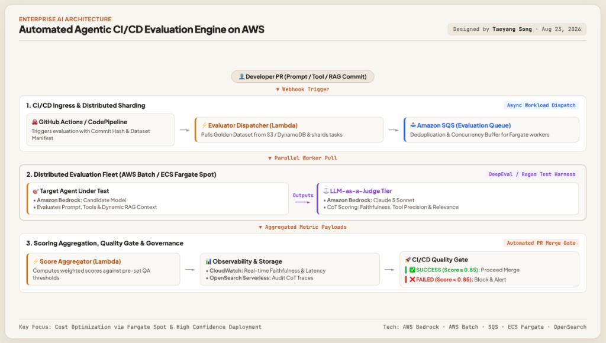
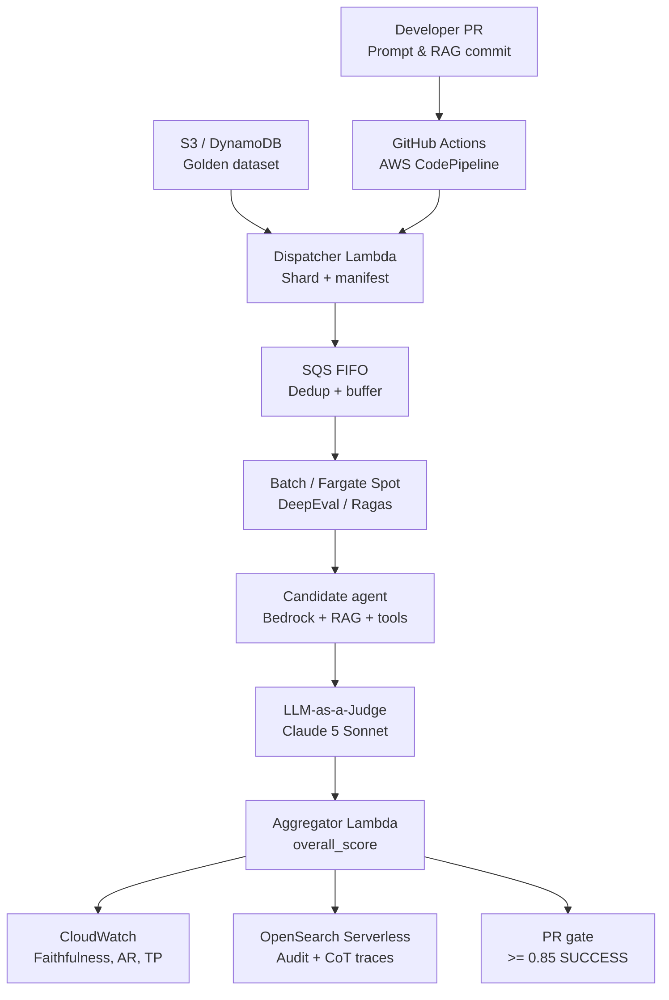

# Agentic CI/CD Evaluation Engine

Automated **LLM-as-a-Judge** quality gate for Agentic RAG and tool-calling workflows. A developer PR (or prompt/RAG commit) triggers sharding over **Amazon SQS FIFO**, evaluation on **ECS Fargate Spot / AWS Batch**, and a merge decision of **overall score ≥ 0.85**.



## Architectural audit — Agentic quality gate

Rigorous check of this repository against the three-layer target: CI/CD trigger and sharding, distributed evaluation fleet, scoring aggregation and governance. Verification: 22 pytest tests, Ruff clean, `tsc --noEmit` clean, local dry-run 10/10 PASS at overall 1.000 vs gate 0.85.

| **15/15** | **0.85** | **Claude 5 Sonnet** | **FIFO** |
| --- | --- | --- | --- |
| Spec controls matched | Overall-score gate | LLM-as-a-Judge | Eval job queue |

**Verdict: compliant with the target architecture**

Dispatcher always shards onto SQS FIFO after reading S3 or the DynamoDB dataset manifest. Fargate Spot and AWS Batch both consume that queue. Workers run the Bedrock candidate (RAG index + tool runner) under a Claude 5 Sonnet judge. Aggregator publishes CloudWatch Faithfulness / AnswerRelevance / ToolPrecision, indexes OpenSearch Serverless CoT audits, and gates the PR at overall_score 0.85 with Slack on failure.

### Live control plane (as implemented)

Source: repository contracts and CDK after this audit · three ranks match spec layers 1–3.



| Node | Role |
| --- | --- |
| Developer PR | Prompt & RAG commit |
| GitHub Actions | AWS CodePipeline |
| Dispatcher Lambda | Shard + manifest |
| S3 / DynamoDB | Golden dataset |
| SQS FIFO | Dedup + buffer |
| Batch / Fargate Spot | DeepEval / Ragas |
| Candidate agent | Bedrock + RAG + tools |
| LLM-as-a-Judge | Claude 5 Sonnet |
| Aggregator Lambda | `overall_score` |
| CloudWatch | Faithfulness, AR, TP |
| OpenSearch Serverless | Audit + CoT traces |
| PR gate | `>= 0.85` SUCCESS |

### Layer mapping

**CI/CD trigger and sharding**

Webhook into GitHub Actions or CodePipeline. Dispatcher Lambda loads the golden set from S3 or DynamoDB, writes a commit-keyed manifest, and fans out FIFO messages with per-shard group and dedup ids.

**Distributed evaluation fleet**

ECS Fargate Spot (weight 4, on-demand fallback) plus AWS Batch Fargate Spot. Containers run DeepEval/Ragas. Candidate model + lexical RAG + allowlisted tools produce traces; Claude 5 Sonnet scores with chain-of-thought.

**Aggregation and governance**

Aggregator computes overall_score. CloudWatch dashboard + OpenSearch eval-audit. GitHub Check success at >= 0.85; failure blocks merge and posts Slack.

### Requirement-by-requirement compliance

| Layer | Spec requirement | Implementation | Status |
| --- | --- | --- | --- |
| 1. Trigger | Webhook from PR / prompt & RAG commit | GitHub Actions `eval-pipeline.yml` + optional CodePipeline / CodeStar | Compliant |
| 1. Trigger | GitHub Actions / AWS CodePipeline | GHA default; `EvalCodePipeline` when `CODESTAR_CONNECTION_ARN` is set | Compliant |
| 1. Trigger | Trigger with commit hash & dataset manifest | Dispatcher payload `git_sha` + `dataset_id`; DynamoDB manifests table | Compliant |
| 1. Trigger | Evaluator Dispatcher Lambda | `services/dispatcher` — S3 Object Created + direct invoke | Compliant |
| 1. Trigger | Pull golden dataset from S3 / DynamoDB | Manifest lookup then S3 object body; writes `DatasetManifest` | Compliant |
| 1. Trigger | SQS eval queue with dedup + concurrency buffer | FIFO queues, `MessageGroupId` per shard, `MessageDeduplicationId` | Compliant |
| 2. Fleet | AWS Batch / ECS Fargate Spot | Both provisioned; `COMPUTE_BACKEND=ecs\|batch\|both`; always consume SQS | Compliant |
| 2. Fleet | Parallel evaluator containers (DeepEval / Ragas) | Worker image `INSTALL_EVAL_LIBS=true`; `EVAL_BACKEND=deepeval` default | Compliant |
| 2. Fleet | Target agent: Bedrock candidate + RAG + tool runner | `EVAL_MODE=candidate`; `candidate_agent.py`, `rag_index.py`, `tool_runner.py` | Compliant |
| 2. Fleet | Judge: Bedrock Claude 5 Sonnet + CoT scoring | `us.anthropic.claude-sonnet-5`; `chain_of_thought` on `MetricScore` | Compliant |
| 3. Gate | Score Aggregator Lambda + pass/fail thresholds | `overall_score` = mean(faithfulness, answer_relevance, tool_precision) | Compliant |
| 3. Gate | CloudWatch: Faithfulness, Answer Relevance, Tool Precision | Namespace `AgenticQualityGate` + dashboard widgets | Compliant |
| 3. Gate | OpenSearch Serverless audit logs + per-sample CoT | `eval-audit` / `eval-cases` / `eval-reports`; SigV4 service `aoss` | Compliant |
| 3. Gate | Score ≥ 0.85 → GitHub SUCCESS | Check conclusion `success`; GHA job exits 0 | Compliant |
| 3. Gate | Score < 0.85 → FAILED, block merge, Slack alert | Check `failure` + required status check; Slack webhook on fail only | Compliant |

### Gate math

`overall_score` is the mean of the three metric means. Primary rule is `overall_score >= 0.85` proceed, otherwise fail. Timeout, zero results, or error rate above 5% also fail — they are operational failures, not extra metric floors.

| Contract | Default |
| --- | --- |
| overall / faithfulness / answer relevance / tool precision | `0.85` |
| Judge | Claude 5 Sonnet (`us.anthropic.claude-sonnet-5`) |
| Candidate | Claude 3.5 Haiku (Bedrock) |
| Default mode / backend | `candidate` / `deepeval` |

### Gaps closed in this audit

| Was (pre-audit) | Now (spec) |
| --- | --- |
| Standard SQS | FIFO + `MessageGroupId` / `MessageDeduplicationId` |
| Dataset from S3 only | S3 or DynamoDB manifests table |
| ECS only | ECS Fargate Spot and AWS Batch Fargate Spot |
| DeepEval optional, native default | DeepEval default; libs baked into image |
| Offline traces or HTTP agent | In-process Bedrock candidate + RAG + tools |
| Judge default Haiku | Claude 5 Sonnet |
| Per-metric floors 0.70 / 0.80 | Composite `overall_score >= 0.85` |
| Powertools metrics only | `PutMetricData` Faithfulness / AnswerRelevance / ToolPrecision |
| No Slack | Incoming webhook on gate failure |
| GHA only | Optional CodePipeline + CodeBuild dispatch |
| OpenSearch signed as `es` | SigV4 service `aoss` for Serverless |

**Operating notes.** Candidate RAG is lexical over the golden-case corpus (swap-in point for a Bedrock Knowledge Base). Tool runner replays allowlisted calls in CI so tool precision is deterministic. Both compute fleets are always synthesized; `COMPUTE_BACKEND` chooses which one scales on a given run. Mark GitHub check `agentic-quality-gate` required to actually block merge.

## What is gated

The **deployment decision** is a single composite **overall score** (mean of faithfulness, answer relevance, and tool-selection precision):

| Outcome | Rule |
| --- | --- |
| ✅ SUCCESS (proceed) | `overall_score >= 0.85` |
| ❌ FAILED (block merge + Slack) | `overall_score < 0.85`, timeout, or no results |

Per-metric series are still published to CloudWatch and shown on the PR comment. The judge is **Claude 5 Sonnet**; the agent under test is a Bedrock **candidate** model with an in-container RAG index and tool runner. DeepEval/Ragas is the default harness (native Bedrock CoT judge is the fallback).

## Repository layout

```text
.
├── .github/workflows/eval-pipeline.yml
├── infra/                      # AWS CDK (TypeScript)
│   ├── sqs.ts                  # SQS FIFO eval + results queues
│   ├── storage.ts              # S3, DynamoDB runs + manifests
│   ├── ecs_evaluator.ts        # ECS Fargate Spot fleet
│   ├── batch_evaluator.ts      # AWS Batch Fargate Spot
│   ├── lambdas.ts              # Dispatcher + aggregator
│   ├── dashboard.ts            # CloudWatch metric dashboard
│   ├── codepipeline.ts         # Optional CodePipeline webhook path
│   └── opensearch.ts           # OpenSearch Serverless audits
├── services/
│   ├── dispatcher/             # Lambda: S3 golden dataset → SQS shards
│   ├── worker/                 # ECS Fargate evaluation harness
│   │   ├── Dockerfile
│   │   ├── test_runner.py
│   │   ├── metrics/            # Faithfulness, answer relevance, tool precision
│   │   └── bedrock_judge.py    # LLM-as-a-Judge with CoT traces
│   └── aggregator/             # Lambda: metrics → Pass/Fail + GitHub Check
├── datasets/golden_dataset_sample.json
├── packages/eval_common/       # Shared pydantic contracts
├── Makefile
└── pyproject.toml
```

## Evaluation modes

- **candidate** (default): in-container **target agent under test** — Bedrock candidate model + RAG index + tool runner, then Claude 5 Sonnet judge.
- **offline**: score `recorded_trace` on each golden case (deterministic CI replay).
- **online**: workers POST `{case_id, query, metadata}` to `AGENT_ENDPOINT`.

Backends (`EVAL_BACKEND`, default `deepeval`):

- `deepeval` / `ragas` — DeepEval/Ragas harness in the evaluator container
- `native` — Bedrock Converse CoT judge
- `all` — adapters plus native

Compute (`COMPUTE_BACKEND`): `ecs` (Fargate Spot long-poll of SQS FIFO) or `batch` (AWS Batch Fargate Spot one-shot jobs). Both fleets are provisioned.

## Local dry-run (no AWS)

```bash
python3 -m venv .venv && source .venv/bin/activate
make install
make test
make eval-local
```

`make eval-local` uses a heuristic scorer so you can validate dataset shape and the gate math without Bedrock. Production scores always come from the Bedrock judge (or DeepEval/Ragas).

## Deploy

Prerequisites: Node 20+, AWS credentials, CDK bootstrap, Bedrock model access for **Claude 5 Sonnet** (judge) and the candidate model, and a GitHub token (or GitHub App) stored in Secrets Manager.

```bash
cp .env.example .env
# set GITHUB_REPO=owner/name  (restricts the OIDC role)
make bootstrap
make deploy
```

After deploy, copy stack outputs into GitHub Actions **variables**:

| Variable | Output |
| --- | --- |
| `AQG_ROLE_ARN` | `GitHubOidcRoleArn` |
| `AQG_DATASET_BUCKET` | `DatasetBucketName` |
| `AQG_RESULTS_BUCKET` | `ResultsBucketName` |
| `AQG_DISPATCHER_FUNCTION` | `DispatcherName` |
| `AWS_REGION` | e.g. `us-east-1` |

Put a GitHub token **and** Slack incoming webhook in the generated secret as `{"GITHUB_TOKEN":"...","SLACK_WEBHOOK_URL":"..."}`. Mark **agentic-quality-gate** as a required status check. Optional: `CODESTAR_CONNECTION_ARN` enables the CodePipeline GitHub source path.

If the account already has a GitHub OIDC provider:

```bash
npx cdk deploy -c githubOidcProviderArn=arn:aws:iam::<account>:oidc-provider/token.actions.githubusercontent.com
```

### Worker image

The evaluator image (`services/worker/Dockerfile`) bakes **DeepEval + Ragas** in by default (`INSTALL_EVAL_LIBS=true`) so containers run the spec harness.

## Runtime path

1. GitHub Actions / CodePipeline uploads the golden set to `s3://$bucket/golden/<commit-sha>.json` and invokes the dispatcher with **commit hash + dataset manifest id**.
2. Dispatcher pulls the dataset from **DynamoDB (manifest) or S3**, writes the manifest, shards cases, and always enqueues **SQS FIFO** messages (`MessageGroupId` + `MessageDeduplicationId`). ECS desired count is bumped, or AWS Batch Fargate Spot jobs are submitted when `COMPUTE_BACKEND=batch`.
3. Parallel evaluator containers (DeepEval/Ragas) run the **target agent** (Bedrock candidate + RAG index + tool runner) and the **Claude 5 Sonnet** judge. Tool-call logs and retrieved contexts go to S3 with the scores.
4. Completing a shard notifies the results FIFO; the aggregator also sweeps every two minutes (`RUN_TIMEOUT_SECONDS`, default 30m).
5. Aggregator computes **overall_score** (mean of Faithfulness, Answer Relevance, Tool Precision), publishes CloudWatch, indexes OpenSearch Serverless (`eval-audit`, `eval-cases`) with per-sample CoT, sets the GitHub Check, and **Slack-alerts on failure**. Merge proceeds only when `overall_score >= 0.85`.

## Golden dataset schema

```json
{
  "version": "1.0",
  "name": "golden",
  "cases": [
    {
      "id": "rag-001",
      "suite": "rag",
      "query": "…",
      "expected_answer": "…",
      "expected_contexts": ["…"],
      "expected_tools": ["search_docs"],
      "recorded_trace": {
        "answer": "…",
        "retrieved_contexts": ["…"],
        "tool_calls": [{ "name": "search_docs", "arguments": {} }]
      }
    }
  ]
}
```

`suite` is `rag` | `tool_calling` | `hybrid`. Case ids must be unique.

## Security and operations

- S3 buckets: TLS only, KMS CMK, Block Public Access, versioning, IA transition.
- SQS: SSE, `enforceSSL`, DLQ + alarm.
- Lambdas: ARM64, X-Ray, Powertools metrics under `AgenticQualityGate`.
- Workers: non-root uid 10001, Fargate Spot with on-demand fallback (`weight 4 / 1`), scale 0–`MAX_WORKERS`.
- IAM: task role is limited to the eval queue, result buckets, DynamoDB, and `bedrock:InvokeModel`. GitHub uses OIDC (no static keys).
- OpenSearch Serverless collection is IAM-auth; data-access policy lists dispatcher/aggregator/worker roles.

Tune thresholds with `THRESHOLD_*` on the stack (see `.env.example`). Judge token spend is estimated on the report (`JUDGE_*_USD_PER_MTOK`).

## Development

```bash
make fmt
make lint
make test
```

Python 3.12, Ruff, pytest, moto. CDK app lives in `infra/` (`npx cdk synth`).
