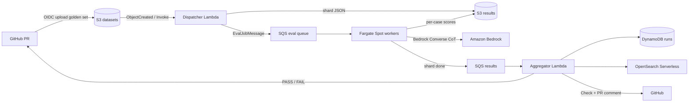

# Agentic CI/CD Evaluation Engine

Production-grade **quality gate** for Agentic RAG and tool-calling workflows. Pull requests are scored with **LLM-as-a-Judge** (Amazon Bedrock, DeepEval/Ragas-compatible metrics) before merge. Work is sharded over **Amazon SQS** and executed on **ECS Fargate Spot** workers; an aggregator applies metric thresholds and publishes a GitHub Check.



## What is gated

| Metric | How it is scored | Default threshold |
| --- | --- | --- |
| **Faithfulness** | Bedrock judge extracts claims from the answer and checks each against retrieved context (chain-of-thought stored on the result). | mean ≥ 0.70 |
| **Answer relevance** | Bedrock judge scores whether the answer addresses the question, using `expected_answer` as a rubric. | mean ≥ 0.70 |
| **Tool-selection precision** | Deterministic: `\|expected ∩ actual\| / \|actual\|` from the agent trace. Hallucinated tools fail the case. | mean ≥ 0.80 |
| **Case pass rate** | Share of cases where every metric passed. | ≥ 0.85 |
| **Error rate** | Worker/judge exceptions. | ≤ 0.05 |

A PR **fails** if any of those checks trip, if the run times out, or if no results arrive. The aggregator is idempotent: a completed run is not re-gated unless `force=true`.

## Repository layout

```text
.
├── .github/workflows/eval-pipeline.yml
├── infra/                      # AWS CDK (TypeScript)
│   ├── sqs.ts
│   ├── ecs_evaluator.ts
│   ├── lambdas.ts
│   └── opensearch.ts
├── services/
│   ├── dispatcher/             # Lambda: S3 golden dataset → SQS shards
│   ├── worker/                 # ECS Fargate evaluation harness
│   │   ├── Dockerfile
│   │   ├── test_runner.py
│   │   ├── metrics/            # Faithfulness, answer relevance, tool precision
│   │   └── bedrock_judge.py    # LLM-as-a-Judge with CoT traces
│   └── aggregator/             # Lambda: metrics → Pass/Fail + GitHub Check
├── datasets/golden_dataset_sample.json
├── packages/eval_common/       # Shared pydantic contracts
├── Makefile
└── pyproject.toml
```

## Evaluation modes

- **offline** (default): score `recorded_trace` on each golden case. Use this in CI to pin regressions without calling the live agent.
- **online**: workers POST `{case_id, query, metadata}` to `AGENT_ENDPOINT` and judge the live trace. The agent must return `{answer, retrieved_contexts, tool_calls}`.

Backends (`EVAL_BACKEND`):

- `native` — Bedrock Converse judge (default, production path)
- `deepeval` / `ragas` — optional adapters (`INSTALL_EVAL_LIBS=true` on the worker image)
- `all` — native plus adapters when libraries are present

## Local dry-run (no AWS)

```bash
python3 -m venv .venv && source .venv/bin/activate
make install
make test
make eval-local
```

`make eval-local` uses a heuristic scorer so you can validate dataset shape and the gate math without Bedrock. Production scores always come from the Bedrock judge (or DeepEval/Ragas).

## Deploy

Prerequisites: Node 20+, AWS credentials, CDK bootstrap, Bedrock model access for the judge (default `us.anthropic.claude-3-5-haiku-20241022-v1:0`), and a GitHub token (or GitHub App) stored in Secrets Manager.

```bash
cp .env.example .env
# set GITHUB_REPO=owner/name  (restricts the OIDC role)
make bootstrap
make deploy
```

After deploy, copy stack outputs into GitHub Actions **variables**:

| Variable | Output |
| --- | --- |
| `AQG_ROLE_ARN` | `GitHubOidcRoleArn` |
| `AQG_DATASET_BUCKET` | `DatasetBucketName` |
| `AQG_RESULTS_BUCKET` | `ResultsBucketName` |
| `AQG_DISPATCHER_FUNCTION` | `DispatcherName` |
| `AWS_REGION` | e.g. `us-east-1` |

Put a GitHub token in the generated secret (`GitHubSecretArn`) as `{"GITHUB_TOKEN":"ghp_..."}` so the aggregator can write [Check Runs](https://docs.github.com/en/rest/checks/runs) and PR comments. Mark **agentic-quality-gate** as a required status check on the protected branch.

If the account already has a GitHub OIDC provider:

```bash
npx cdk deploy -c githubOidcProviderArn=arn:aws:iam::<account>:oidc-provider/token.actions.githubusercontent.com
```

### Worker image

The Fargate task is built from `services/worker/Dockerfile` (repo root as context). To bake DeepEval + Ragas into the image:

```bash
INSTALL_EVAL_LIBS=true make docker-build
INSTALL_EVAL_LIBS=true make deploy
```

## Runtime path

1. GitHub Actions uploads `datasets/golden_dataset_sample.json` to `s3://$bucket/golden/<sha>.json` and invokes the dispatcher (S3 `golden/*.json` also triggers it).
2. Dispatcher validates the dataset, writes a DynamoDB/S3 manifest, shards cases (default 8 / message), and enqueues `EvalJobMessage` bodies. It bumps the ECS service desired count so Fargate Spot can scale from zero.
3. Workers long-poll SQS, honor `SIGTERM` on Spot interruption, call Bedrock with retries/jitter, and write `runs/<id>/results/shard-NNNN.json`. Failed shards retry three times then land on the DLQ (CloudWatch alarm).
4. Completing a shard notifies the results queue; the aggregator also sweeps every two minutes for timeouts (`RUN_TIMEOUT_SECONDS`, default 30m).
5. Aggregator computes mean / p50 / p95, applies thresholds, indexes OpenSearch (`eval-reports`, `eval-cases`), and publishes the GitHub Check. The Actions job polls `runs/<id>/report.json` and fails the PR on `decision.passed != true`.

## Golden dataset schema

```json
{
  "version": "1.0",
  "name": "golden",
  "cases": [
    {
      "id": "rag-001",
      "suite": "rag",
      "query": "…",
      "expected_answer": "…",
      "expected_contexts": ["…"],
      "expected_tools": ["search_docs"],
      "recorded_trace": {
        "answer": "…",
        "retrieved_contexts": ["…"],
        "tool_calls": [{ "name": "search_docs", "arguments": {} }]
      }
    }
  ]
}
```

`suite` is `rag` | `tool_calling` | `hybrid`. Case ids must be unique.

## Security and operations

- S3 buckets: TLS only, KMS CMK, Block Public Access, versioning, IA transition.
- SQS: SSE, `enforceSSL`, DLQ + alarm.
- Lambdas: ARM64, X-Ray, Powertools metrics under `AgenticQualityGate`.
- Workers: non-root uid 10001, Fargate Spot with on-demand fallback (`weight 4 / 1`), scale 0–`MAX_WORKERS`.
- IAM: task role is limited to the eval queue, result buckets, DynamoDB, and `bedrock:InvokeModel`. GitHub uses OIDC (no static keys).
- OpenSearch Serverless collection is IAM-auth; data-access policy lists dispatcher/aggregator/worker roles.

Tune thresholds with `THRESHOLD_*` on the stack (see `.env.example`). Judge token spend is estimated on the report (`JUDGE_*_USD_PER_MTOK`).

## Development

```bash
make fmt
make lint
make test
```

Python 3.12, Ruff, pytest, moto. CDK app lives in `infra/` (`npx cdk synth`).
